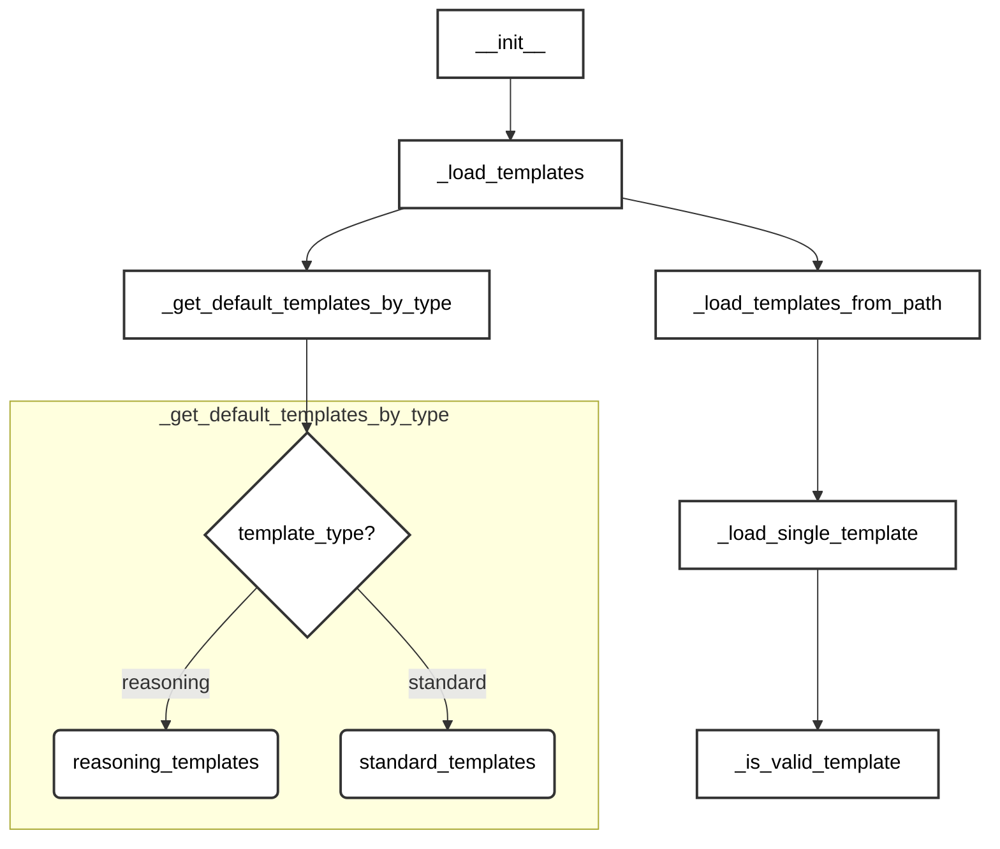

# PromptManager 模板管理详解

## 1. 模板系统概述

### 1.1 模板类型
1. **标准模板**
   - 基础生成模板 (`basic_generation`)
   - 领域特定模板 (`domain_specific`)
   - 复杂推理模板 (`complex_reasoning`)

2. **推理模板**
   - 代码推理模板 (`loong_code`)
   - 数学推理模板 (`math_reasoning`)

### 1.2 模板格式
每个模板包含两个关键部分：
```python
{
    "system_message": str,  # 系统指令
    "user_template": str    # 用户模板
}
```

## 2. 模板加载流程

### 2.1 加载策略



## TODO List
- [ ] 大模型API接口
  - [ ] loong 模版导入？& 内部统一
  - [ ] 与prompt_manager接口统一
- [ ] prompt_manager修改
  - [ ] 数据合成:推理数据(q,r,a)和 普通(q,a)数据合成
  - [ ] 推理数据:推理数据(q,r,a)和 普通(q,a)数据合成
  - [ ] 数据蒸馏:推理链生成模版
  - [ ] 数据正确性验证:verification模版
- [ ] 补充文档
  - [ ] 添加更多使用示例
  - [ ] 完善API文档
  - [ ] 逻辑理清